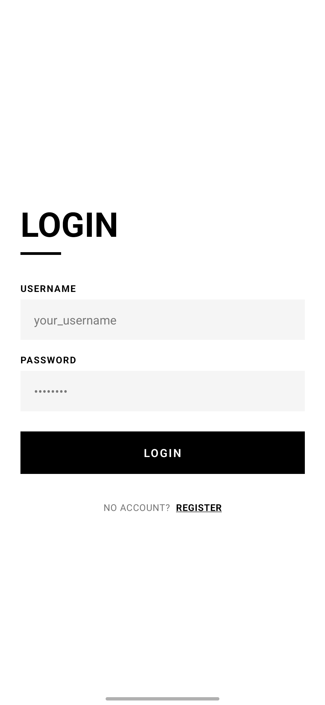
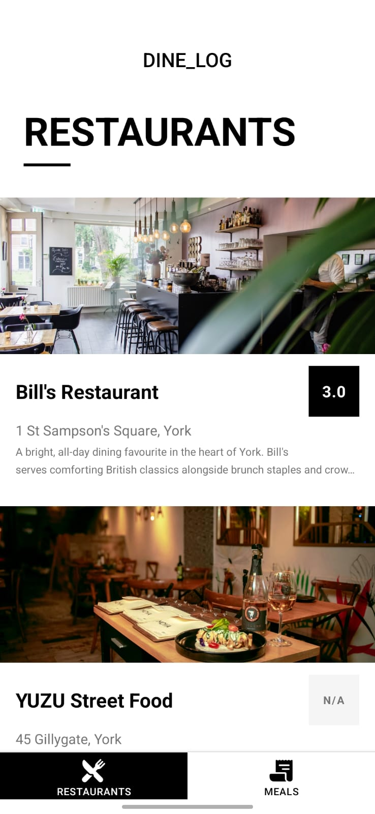
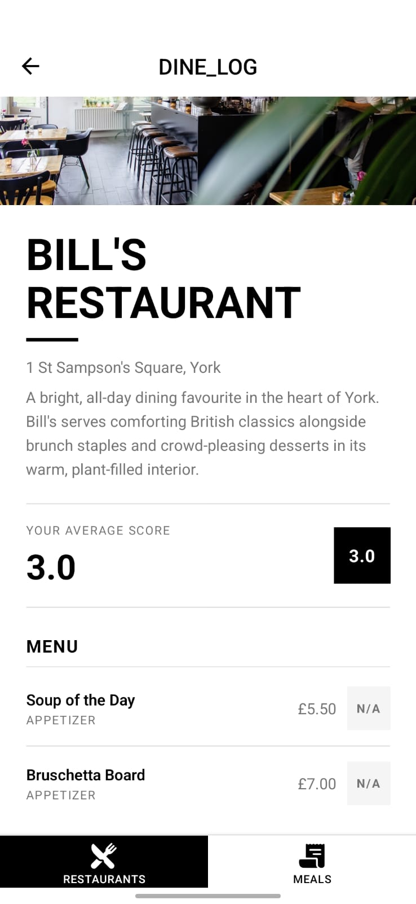
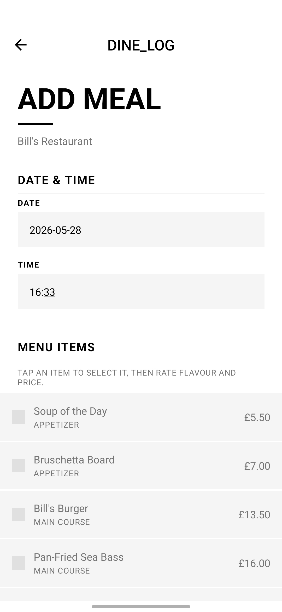
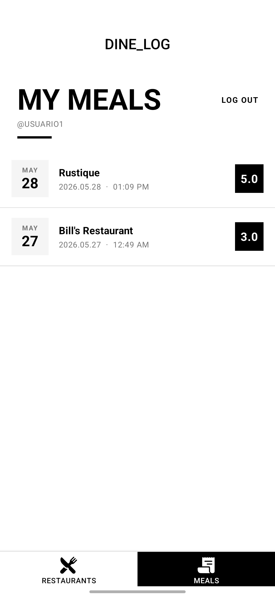

# DINE_LOG

## 1. Project Overview

DINE_LOG is a mobile application built for the York Developer's Lunch Club scenario as part of a university software engineering assessment. The club comprises a group of developers who meet weekly to try local restaurants, and the application provides a structured way for members to log and review their dining experiences.

The application allows users to register individual accounts, browse a curated list of participating restaurants, record meals by selecting menu items and assigning personal scores, and review their full meal history. All data is stored locally on the device and is isolated per user, ensuring that each club member maintains their own independent log of visits and ratings.

---

## 2. Features

### Authentication
- **User Registration** — new users create an account with a full name, username, and password
- **Username/password login** — credentials are validated against locally stored user records
- **Biometric authentication** — registered users can log in using fingerprint or device biometrics (device-dependent)
- **Logout** — authenticated session is cleared and the user is returned to the login screen

### Restaurants
- **Restaurant list** — scrollable list of restaurants with name, address, cuisine type, and average score
- **Restaurant details** — full restaurant information including menu items and aggregated ratings per item

### Meals
- **Meal creation** — users select menu items from the restaurant, assign a score (1–5) to each item, and optionally add a date
- **Confirmation flow** — a modal confirmation screen summarises the meal before it is saved, with the option to go back and edit
- **Meal history** — a list of all previously recorded meals for the authenticated user
- **Meal detail view** — full breakdown of a saved meal including items, scores, and visit date

### Data
- **Multi-user data separation** — each user's meals are stored and retrieved independently; no cross-user data access

### Testing
- **Automated tests** — 43 tests across 6 suites covering utility logic and UI components
- **Manual UI testing** — structured manual test execution on a physical Android device, results documented in `docs/manual-testing-report.md`

---

## 3. Technology Stack

| Category | Technology | Version |
|---|---|---|
| Framework | React Native | 0.81.5 |
| Platform | Expo | ^54.0.34 |
| Language | TypeScript | ~5.9.2 |
| Navigation | React Navigation (Native Stack + Bottom Tabs) | ^7.x |
| Local storage | AsyncStorage | 2.2.0 |
| UI gestures | React Native Gesture Handler | ~2.28.0 |
| Animations | React Native Reanimated | ~4.1.1 |
| Test runner | Jest + jest-expo | ^29.7.0 / ~54.0.0 |
| Component testing | React Native Testing Library | ^13.3.3 |

---

## 4. Project Structure

```
dinelog/
├── __mocks__/
│   └── @react-native-async-storage/
│       └── async-storage.js          # AsyncStorage mock for tests
├── __tests__/
│   ├── components/
│   │   ├── MealCard.test.tsx
│   │   └── ScoreBadge.test.tsx
│   └── unit/
│       ├── calculations.test.ts
│       ├── formatting.test.ts
│       ├── storage.test.ts
│       └── validation.test.ts
├── docs/
│   ├── screenshots/                  # Real device screenshots
│   ├── test-plan.md
│   ├── manual-testing-report.md
│   └── ...
├── src/
│   ├── components/                   # Shared UI components
│   │   ├── DateBadge.tsx
│   │   ├── FormInput.tsx
│   │   ├── MealCard.tsx
│   │   ├── MealItemRow.tsx
│   │   ├── MenuItemSelectRow.tsx
│   │   ├── MenuItemStatRow.tsx
│   │   ├── PrimaryButton.tsx
│   │   ├── RestaurantCard.tsx
│   │   ├── ScoreBadge.tsx
│   │   ├── ScoreSelector.tsx
│   │   ├── ScreenTitle.tsx
│   │   ├── SecondaryButton.tsx
│   │   └── SectionTitle.tsx
│   ├── constants/
│   │   ├── colors.ts
│   │   └── typography.ts
│   ├── context/
│   │   └── AuthContext.tsx           # Authentication state and biometric logic
│   ├── data/
│   │   └── restaurants.ts            # Static restaurant and menu data
│   ├── navigation/
│   │   └── AppNavigator.tsx          # Root navigator (auth stack + main tabs)
│   ├── screens/
│   │   ├── AddMealScreen.tsx
│   │   ├── ConfirmMealScreen.tsx
│   │   ├── LoginScreen.tsx
│   │   ├── MealDetailScreen.tsx
│   │   ├── MealListScreen.tsx
│   │   ├── RegisterScreen.tsx
│   │   ├── RestaurantDetailScreen.tsx
│   │   └── RestaurantListScreen.tsx
│   ├── storage/
│   │   ├── mealStorage.ts            # CRUD helpers for meal persistence
│   │   └── userStorage.ts            # CRUD helpers for user persistence
│   ├── types/
│   │   └── index.ts                  # Shared TypeScript types
│   └── utils/
│       ├── calculations.ts           # Score averaging and aggregation
│       ├── formatting.ts             # Date and display formatting
│       └── validation.ts             # Form field validation logic
├── App.tsx                           # Application entry point
├── index.ts
├── package.json
└── tsconfig.json
```

---

## 5. Running the Application

### Prerequisites

- Node.js 18+
- Android device with USB debugging enabled
- [EAS Dev Client APK](https://docs.expo.dev/develop/development-builds/introduction/) installed on the device

> **Why not Expo Go?**
> Expo Go does not support all native APIs used by this project (including the biometric authentication module). The application is therefore run using an **Expo Dev Client** build installed directly on a physical Android device.

### Setup

```bash
npm install
```

### Running

Open three terminals and run the following commands:

#### Terminal 1 — Start the Metro bundler

```bash
npx expo start --dev-client --clear --port 8081
```

#### Terminal 2 — Forward the Metro port to the device

```bash
adb reverse tcp:8081 tcp:8081
```

#### Terminal 3 (Optional) — Mirror the device screen

```bash
scrcpy --stay-awake
```

Once Metro is running and the port is forwarded, open the Dev Client app on the Android device and connect to the local server.

---

## 6. Running Automated Tests

```bash
npm test
```

### Test Results

```text
PASS  __tests__/unit/calculations.test.ts
PASS  __tests__/unit/validation.test.ts
PASS  __tests__/unit/formatting.test.ts
PASS  __tests__/unit/storage.test.ts
PASS  __tests__/components/ScoreBadge.test.tsx
PASS  __tests__/components/MealCard.test.tsx

Test Suites: 6 passed, 6 total
Tests:       43 passed, 43 total
Snapshots:   0 total
```

### What is tested

| Suite | Scope |
|---|---|
| `calculations.test.ts` | Score averaging, aggregation across multiple meals, unrated restaurant handling |
| `validation.test.ts` | Required field detection, password rules, score range enforcement |
| `formatting.test.ts` | Date display formatting, score label rendering, edge cases |
| `storage.test.ts` | AsyncStorage read/write for users and meals, user data isolation |
| `ScoreBadge.test.tsx` | Component renders correct colour and label for each score band |
| `MealCard.test.tsx` | Meal card renders restaurant name, date, items, and score correctly |

To generate a coverage report:

```bash
npm run test:coverage
```

---

## 7. Test Plan Alignment

The following table maps automated test suites to the original test plan IDs defined in `docs/test-plan.md`.

| Test Suite | Test Plan IDs | Functionality Validated |
|---|---|---|
| `validation.test.ts` | REG-02, REG-03, REG-04, REG-05, LOG-03, MEAL-02, MEAL-03, MEAL-04 | Required field validation, password rules, score range boundaries |
| `calculations.test.ts` | RESL-03, RESD-02, MEALS-03 | Average score computation, unrated restaurant display (N/A), per-item score aggregation |
| `formatting.test.ts` | MEALS-01, MEAL-03 | Date formatting in meal history, score label display |
| `storage.test.ts` | REG-01, LOG-01, LOG-02, CONF-01, MEALS-01, MEALS-04 | User creation, credential lookup, meal persistence, per-user data isolation |
| `ScoreBadge.test.tsx` | RESD-02, MEAL-05 | Visual score feedback, correct colour band per score value |
| `MealCard.test.tsx` | MEALS-01, MEALS-02, CONF-03 | Meal summary rendering, accuracy of displayed data |

---

## 8. Manual Testing

Manual UI testing was performed on a physical Android device following the structured test cases defined in `docs/test-plan.md`.

Results are documented in:

```
docs/manual-testing-report.md
```

All manual UI tests were executed and passed successfully. Testing covered the complete user journey from registration through meal logging and history review, including biometric login, navigation flows, confirmation modal behaviour, and edge cases such as empty form submission and invalid score input.

---

## 9. Screenshots

The following screenshots were captured from the application running on a physical Android device.

### Login Screen



### Restaurant List



### Restaurant Detail



### Add Meal



### My Meals



---

## 10. Testing Documentation

The project includes two testing documents that together cover the full validation of the application.

| Document | Purpose |
|---|---|
| [`docs/automated-testing-report.md`](docs/automated-testing-report.md) | Documents all automated Jest tests — unit tests for validation, calculations, formatting, and storage, plus component tests for `ScoreBadge` and `MealCard`. Includes test plan ID mappings and full execution results. |
| [`docs/manual-testing-report.md`](docs/manual-testing-report.md) | Documents structured manual UI testing performed on a physical Android device, covering complete user journeys, navigation behaviour, and device-specific functionality that cannot be reached by automated tests. |

### Running the automated tests

```bash
npm test
```

To generate a coverage report:

```bash
npm run test:coverage
```

---

## 11. Video Demonstration

YouTube demonstration link will be added before final submission.

---

## 12. Final Submission Information

Final commit hash: TO_BE_ADDED

Submission date: TO_BE_ADDED

---

## 13. Known Limitations

- **Local storage only** — all data is persisted on-device using AsyncStorage; there is no remote database or server
- **No cloud synchronisation** — meal records and user accounts do not sync across devices
- **No backend** — authentication is handled entirely client-side against locally stored credentials
- **Biometric authentication is device-dependent** — the biometric login option requires a device with enrolled fingerprint or face recognition; it degrades gracefully when unavailable

---

## 14. Author

**Juan Blanco Moyano**
BSc (Hons) Software Engineering
York St John University
Module: COM6031M Smartphone Application Design and Development
